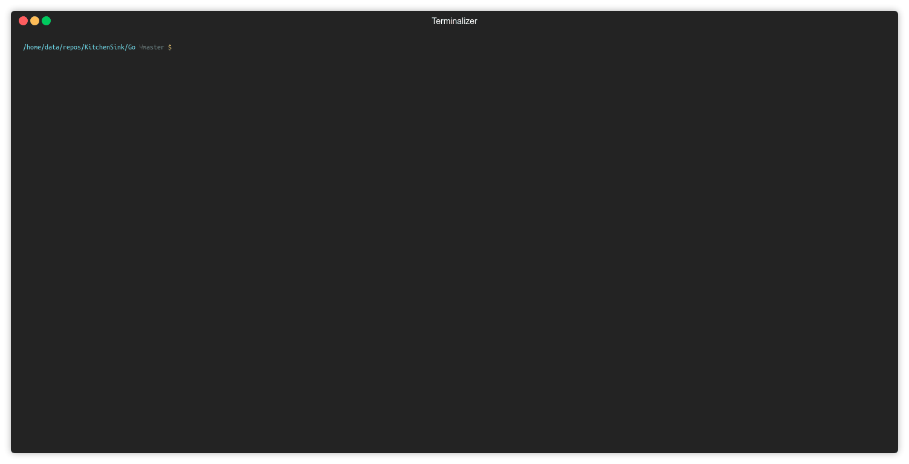

# Cheetsheet

Ops Monitoring
---

dnstop, iftop,iperf


Mysql
---

```
CREATE USER 'newuser'@'localhost' IDENTIFIED BY 'password';
GRANT ALL PRIVILEGES ON * . * TO 'newuser'@'localhost';
```

Network
---

```
tcpflow -i eth1  port 8094 -C
```

### APT through proxy

In /etc/apt/apt.conf
```
Acquire::http::Proxy "http://proxy:3128";
```


### Generate file of arbitraty size

```
dd if=/dev/zero of=1g.img bs=1 count=0 seek=1G (1G)
dd if=/dev/zero of=test.img bs=1024 count=0 seek=$[1024*10] (10MB)
```


### List for older distributions  (ubuntu)

```
root@ubuntu-mesos-master:/etc/zookeeper/conf#  apt-cache madison docker-ce
 docker-ce | 5:18.09.0~3-0~ubuntu-xenial | https://download.docker.com/linux/ubuntu xenial/stable amd64 Packages
 docker-ce | 18.06.1~ce~3-0~ubuntu | https://download.docker.com/linux/ubuntu xenial/stable amd64 Packages
 docker-ce | 18.06.0~ce~3-0~ubuntu | https://download.docker.com/linux/ubuntu xenial/stable amd64 Packages
 docker-ce | 18.03.1~ce-0~ubuntu | https://download.docker.com/linux/ubuntu xenial/stable amd64 Packages
```

### GPG

```
gpg2 --batch --gen-key  ./keyData
gpg2 --list-keys
gpg2 --output  testfile_decrypt.txt --decrypt testfile.gpg
gpg2 --output  testfile.gpg --encrypt --recipient xxx@xxxx testfile.txt
gpg2 --armor --export xxx@xxxx
gpg2 --armor --export-secret-keys xxx@xxxx
```
Check encryption key id 
```
gpg2 --list-packets duplicity-full.20200125T095437Z.vol1.difftar.gpg 
gpg: encrypted with RSA key, ID FB0F52F6BA77FB4D
```


### DUPLICITY

Create
```
duplicity --progress --encrypt-key=xxxx --encrypt-secret-keyring=/home/xxxx/.gnupg/trustdb.gpg   /home/xxxx/test/ file:///NAS/Backups/
duplicity list-current-files file:///NAS/Backups
```
Restore
```
duplicity restore file:///opt/raid/Backups/ .
```


## DEV

### Python

### Terminalizer 

Optimize GIF size from terminalizer

```
╰─$ convert demo.gif   -fuzz 20% -layers Optimize result.gif
```

### SDKMAN

```
sdk install java 8-oracle /Library/Java/JavaVirtualMachines/jdk1.8.0_201.jdk/Contents/Home
sdk default java 8-oracle
sdk list java
```

### AWS CLI

```
apt install awscli
```

```
AWS Access Key ID [None]: xxxxxxxxxxxxxxxxxxx 
AWS Secret Access Key [None]: xxxxxxxxxxxxxxxxxxx
Default region name [None]: us-west-2
Default output format [None]: json
```

```
aws s3 ls s3://some-logs/api/
aws s3 mv  s3://dir/ /local/path/s3/ --recursive
```

### GCloud

```
gcloud components list
gcloud components install pubsub-emulator
gcloud components update
gcloud beta emulators pubsub start
```

### Apache Ignite

```
./control.sh --activate
./sqlline.sh -u jdbc:ignite:thin://xxx.xxx.xxx.xxx
```

### Protobuffers

```
protoc -I service/ service/service.proto --go_out=plugins=grpc:service
```

### Memcached

```
stats slabs
stats cachedump 3 100

```
```
watch memcdump --servers=localhost
```


### Ansible 

#### Test connectivity

```
[root@localhost openshift-ansible]# ansible -i inventory/hosts.localhost all -m  ping 
localhost | SUCCESS => {
    "changed": false, 
    "ping": "pong"
}

```

### Ask for password instead of ssh auth + sudo w/o parssword

```
 ansible-playbook playbook.yml --sudo  --ask-pass --ask-sudo-pass
```


### Bash

#### Copy Keys

```
for x in 52.32.30.222 34.211.88.188 52.32.135.222 22.164.194.22
do 
        ssh -i key.pem ubuntu@$x 'sudo apt-get -y install python'
done
```

#### Check ignorecase

```
Z="${X,,}"
if [ "$Z" = "y" ]; then
    echo "YES"
```


### GO

#### Project

[GoReportCard ](https://github.com/gojp/goreportcard)

```
go build -ldflags "-X main.Build=$(git rev-parse --short HEAD)"
```




### Hadoop 

#### HDFS health report

```
hdfs dfsadmin -report
```

#### Basic operrations 

```
hdfs dfs -ls /dataset/
hdfs dfs -put TrafficSpeeds.csv /dataset/
hdfs dfs -put Crimes.csv /dataset/
```

#### Import files with provided replication factor

```
 hdfs dfs -D dfs.replication=8 -put * /datasets/
```

#### Remove Recursive Dir

```
 hdfs dfs -rmr /tmp/tpcds-generate
```
#### List jobs

```
hadoop job -list
```


### Hive

```
hive --hiveconf hive.root.logger=INFO,console
```

```
hive> CREATE EXTERNAL TABLE IF NOT EXISTS Crimes(ID INT, Case_Number STRING, daate STRING, Block STRING, IUCR STRING, Primary_Type STRING, Description STRING, Location_Description STRING, Arrest STRING, Domestic STRING, Beat STRING, District STRING, Ward STRING, Community_Area STRING, FBI_Code STRING, X_Coordinate STRING, Y_Coordinate STRING, Year STRING, Updated_On STRING, Latitude STRING, Longitude STRING, Location STRING) ROW FORMAT DELIMITED FIELDS TERMINATED BY ',' STORED AS TEXTFILE LOCATION '/user/username/names';

hive> LOAD DATA INPATH '/datasets/Crimes.csv' INTO TABLE Crimes;
```

#### Relevant settings 

```
set mapreduce.input.fileinputformat.split.maxsize=14000000;
set hive.merge.mapfiles=true;
set hive.map.aggr.hash.percentmemory=0.5;
set hive.smbjoin.cache.rows=10000;
```

#### Benchmark

[Hive testbench](https://github.com/hortonworks/hive-testbench)


### Openshift 


#### Installing dependencies

```
yum update -y && yum install -y install epel-release && yum install -y vim net-tools git  python-pip
```

* Ansible default installation 2.4 is too old

```
pip install --upgrade pip
pip install ansible==2.6.2
``` 

* Set SELinux to **permissive** mode

#### Running prerequisites playbook

Checkout tag ```git checkout tags/v3.10.0 -b v3.10.0```

Run prerequisites playbook ```ansible-playbook -i inventory/hosts.localhost  playbooks/prerequisites.yml ```

Run deployment playbook ```[root@localhost openshift-ansible]# ansible-playbook -i inventory/hosts.localhost  playbooks/deploy_cluster.yml```

Once ready navigate to ```https://192.168.2.200:8443```

```
https://docs.openshift.com/container-platform/3.4/install_config/install/advanced_install.html#uninstalling-advanced
```


### GRPC

#### RPC types 

* Unary RPCs request / response model ```rpc SayHello(HelloRequest) returns (HelloResponse)```

* Server Streaming RPC request  / multiple messages back ```pc LotsOfReplies(HelloRequest) returns (stream HelloResponse)```

* Client streaming RPCs ```rpc LotsOfGreetings(stream HelloRequest) returns (HelloResponse)```

* Bidirectional Steaming ```rpc BidiHello(stream HelloRequest) returns (stream HelloResponse)```


##### Error Codes

* [Status codes](https://github.com/googleapis/googleapis/blob/master/google/rpc/code.proto)


### Vault

#### Initialization

```
vault operator init
```
#### Unseal

```
vault operator unseal
```

#### Export Token

available through init

```
export VAULT_TOKEN=s.xxxxxxxxxxxxxx
```

#### Login
```
vault login
```

#### Enable secrets 

```
vault secrets enable -path=kv kv
Success! Enabled the kv secrets engine at: kv/
```

#### Put 

```
vault kv put kv/hello foo=world
Success! Data written to: kv/hello
```

#### List

```
vault secrets list
Path          Type         Accessor              Description
----          ----         --------              -----------
cubbyhole/    cubbyhole    cubbyhole_fb8565a6    per-token private secret storage
identity/     identity     identity_77bfb1d1     identity store
kv/           kv           kv_0e879e5b           n/a
sys/          system       system_fd4254e7       system endpoints used for control, policy and debugging
```


### Object Query Language

```
select filter(heap.classes(), "/java.net./.test(it.name)")
```

```
select count(heap.classes(), "/com.zzz./.test(it.name)")
```

```
 select map(filter(heap.classes(), "/java.net./.test(it.name)"),
      function (it) {
         var res = '';
         while (it != null) {
            res += toHtml(it) + "->";
            it = it.parent;
         }
         res += "null";
         return res + "<br>";
      })
```

##### Filtered count
```
select map(filter(heap.classes(), "/eclipse./.test(it.name)"),
      function (it) {
         var res = '';
         var cnt=0;
         while (it != null) {
            objs = heap.objects(it);
            cnt= count(objs);
            if (cnt>10) {
res += "<br/>"+toHtml(it) + "-> Count: "+cnt;
           }
            it = it.next;
         }
         return res ;
      })

```

#### Compute size
```
  select sum(map(heap.objects("lombok.eclipse.EclipseNode"), 'sizeof(it)'))

```


### Wildfly

* Access cli 
```
./bin/jboss-cli.sh
[disconnected /] connect localhost:9990
[standalone@localhost:9990 /]
```

* Remove subsystem

```
[standalone@localhost:9990 /] /subsystem=batch-jberet:remove
{
    "outcome" => "success",
    "response-headers" => {
        "operation-requires-reload" => true,
        "process-state" => "reload-required"
    }
}
[standalone@localhost:9990 /] reload
```

```
[standalone@localhost:9990 /] /subsystem=ejb3/strict-max-bean-instance-pool=slsb-strict-max-pool/:read-resource
{
    "outcome" => "success",
    "result" => {
        "derive-size" => "from-worker-pools",
        "max-pool-size" => 20,
        "timeout" => 5L,
        "timeout-unit" => "MINUTES"
    }
}
```


```
[standalone@localhost:9990 /] /subsystem=ejb3/thread-pool=default:read-resource
{
    "outcome" => "success",
    "result" => {
        "keepalive-time" => {
            "time" => 100L,
            "unit" => "MILLISECONDS"
        },
        "max-threads" => 10,
        "name" => "default",
        "thread-factory" => undefined
    }
}
```

```
[standalone@localhost:9990 /] /subsystem=ejb3/thread-pool=default:write-attribute(name=max-threads,value=512)
```

#### List JNDI 

```
/subsystem=naming:jndi-view()
```

#### Running scripts

```
./jboss-cli.sh -c --file=./disable-modules.cli
```


```
 /subsystem=undertow/server=default-server/http-listener=default:read-resource(include-runtime=true)
```

```
/subsystem=logging/root-logger=ROOT:change-root-log-level(level=WARN)
```


### KVM

#### Increase VM memory

```
virsh # setmaxmem ion-os-mas-01 18G --config
virsh # setmem ion-os-mas-01 18G --config
```

#### List pools

```
pool-list
```

#### List volumes in pool

```
vol-list POOL_NAME
```

#### List pools / volumes

```
virsh # pool-list --all
virsh # vol-list libvirt
```

#### Delete volume

```
virsh # vol-delete ion-os-master-01 --pool libvirt
Vol ion-os-master-01 deleted
```

#### Add VCPUs

```
virsh # edit kubernetes-01  Put #<vcpu placement='static'>8</vcpu>
virsh # setvcpus --count 2 kubernetes-01
```


### R Cheetsheet

#### Remove DataFrame

```
rm(df)
```

#### Workspace

Clean 

```
rm(list=ls())
```

List
```
print(ls())
```

List with patterns
```
print(ls(pattern = "var"))
```

#### Obtain help

```
help(filter)
```
#### Filter Dataframe

```
View(subset(DF_NAME, DF_NAME$PROP>100000 & DH_NAME$PROP<200000));
```

```
View(DH_NAME[ which(DF_NAME$ClassName=='org.jboss.dmr.ModelNode'), ])
```

```
View(subset(DF_NAME, regexpr("^java.*",DF_NAME$ClassName)>0));
```

#### Filter DataFrame and sum computation

```
format(structure(sum(subset(DF_NAME$PROP, regexpr(".*java.*",DF_NAME$PROP)>0)), class="object_size"), units="auto");
```

#### Library

```
library()
```
